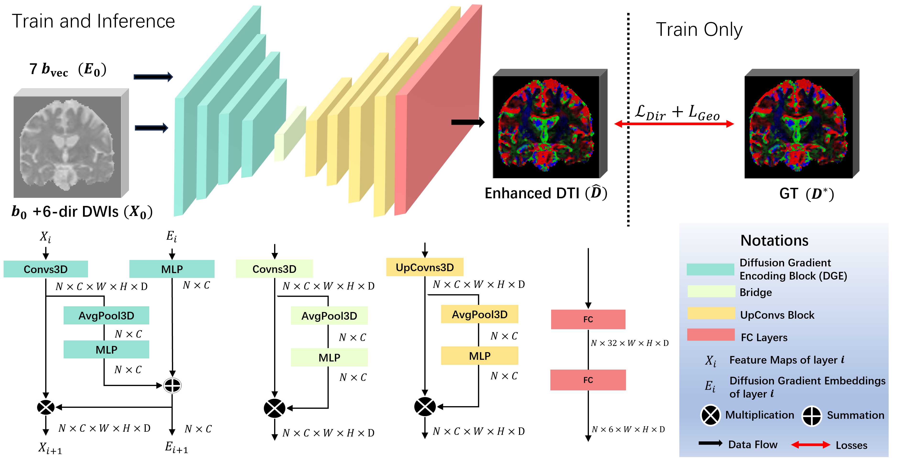

# DirGeo-Net

Official PyTorch implementation of DirGeo-Net: Angular Resolution Enhancement via Directional and Geometric Learning in Brain Diffusion Tensor Imaging.

This paper has been **accepted to ICONIP2024** and awarded as the **Best student Paper**.




## Dependencies

* Python == 3.10

*Pytorch version*
* torch == 2.0

## Data

**Please refer to the official website (or project repo) for license and terms of usage.**
**Some preprocessing have been applied to the original data before feeding into our data loader. Please find the details in our paper.**

**HCP**

- Official Website: https://www.humanconnectome.org/

**PPMI**

- Official Website: https://www.ppmi-info.org/


**Train**
Please refer to the training script in the scripts folder
```
python3 /home/sheng/Diffusion/miccai_2024/HCPAnyDirs_train.py \
--dataroot /home/sheng/Diffusion/data \
--name HCPDirGeo_100 \
--model DirGeo \
--net DirGeo \
--input_nc 7  \
--output_nc 6  \
--lr 0.0001 \
--dataset_mode HCPAnyDirs \
--padded_dirs 6 \
--data_norm z_scoreV2 \
--num_threads 1 \
--batch_size 1 \
--input_batch_sizes 15 \
--patch_shape 64 \
--patch_overlap 32 \
--bounding \
--n_epochs 100 \
--n_epochs_decay 0 \
--display_freq 1 \
--save_epoch_freq 10 \
--gpu_ids 0
```

**Test**
Please refer to the testing script in the scripts folder
```
python3 /home/sheng/Diffusion/miccai_2024/AnyDirs_test.py \
--dataroot /home/sheng/Diffusion/data \
--name HCPDirGeo_100 \
--model DirGeo \
--epoch latest \
--net DirGeo \
--input_nc 7  \
--output_nc 6  \
--dataset_mode HCPAnyDIrsTest \
--data_norm z_scoreV2 \
--serial_batches \
--batch_size 1 \
--bounding \
--patch_shape 64 \
--patch_overlap 32 \
--input_batch_sizes 30 \
--eval \
--num_threads 0 \
--num_test 20 \
--save_prediction 1 \
--gpu_ids 0
```

<!-- Our code framework heavily brought from [CycleGAN](https://github.com/junyanz/pytorch-CycleGAN-and-pix2pix). We appreciate the authors for their contributions on a great open-source framework of deep adversarial learning! -->